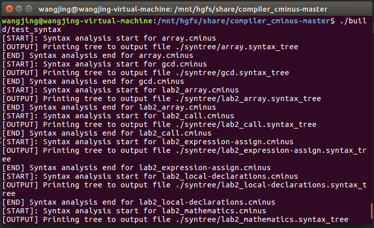
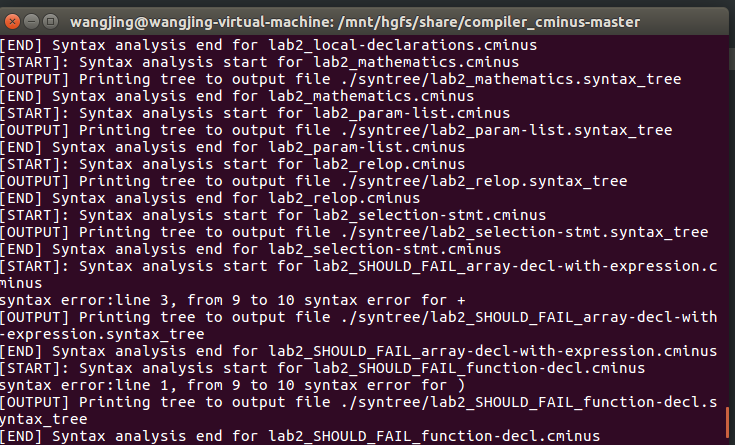
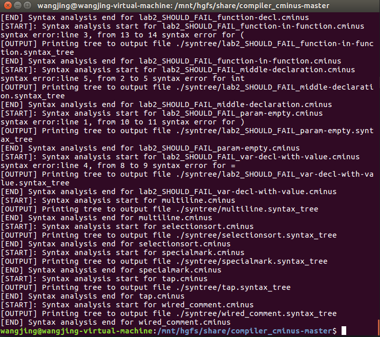
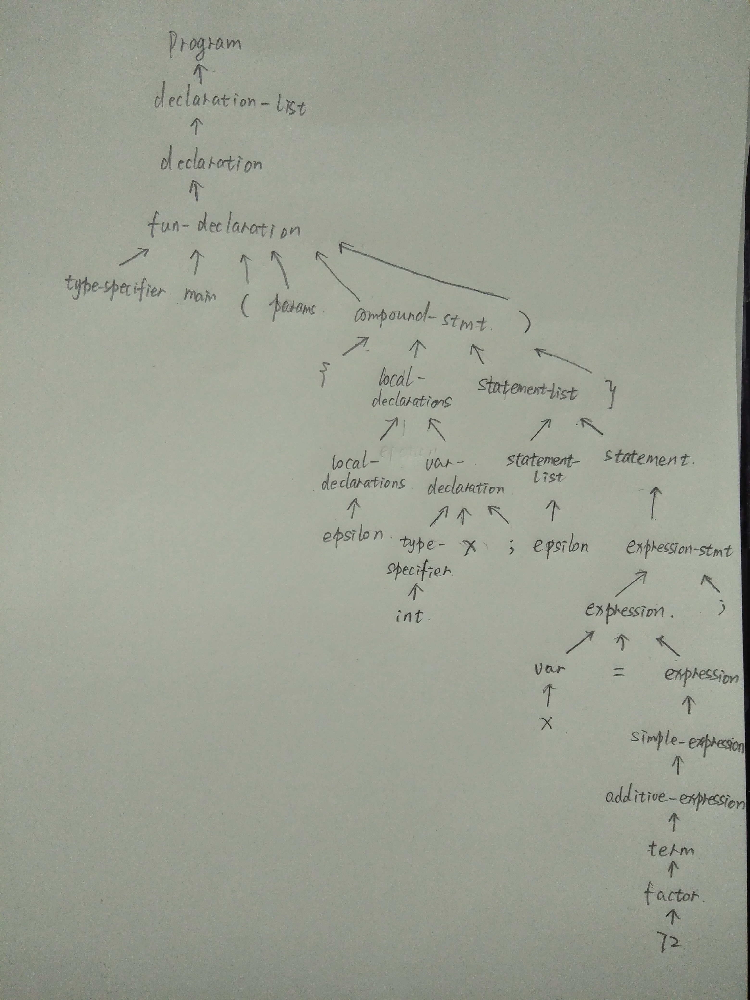

## lab2_syntax_analyzer

#### 一、实验要求：

用flex,bison实现一个语法分析器，并利用助教提供的syntaxTree.c文件打印出最后的语法树。

#### 二、实验设计：

1. 将lab1中已实现的模式动作的相关代码复制到新fork下来的lexical_analyzer.l文件中，并进行相关修改。

```c
/****请在此补全所有flex的模式与动作  start******/   
[\t\r]+   {pos_start = pos_end;
	pos_end  += strlen(yytext);
 }
[ ]+ { pos_start = pos_end;
	pos_end  += strlen(yytext);
 }
[\n]+      {lines+=strlen(yytext);
	pos_start = 1;
	pos_end = 1;}
[/][*]       { 
	pos_start = pos_end;
	pos_end  += strlen(yytext);
	char c;
        char prev = '\0';
        do{ 
         	c = input();
                pos_end += 1;
                if (c == EOF) break;
                if (c == '\n') {lines++;pos_start = 1;pos_end = 1;}
                if (prev == '*' && c == '/')break;
                prev = c;
          } while (1);
	
 }
int         {pos_start=pos_end;pos_end=pos_start+strlen(yytext);return INT;}
else        {pos_start=pos_end;pos_end=pos_start+strlen(yytext);return ELSE;}
if          {pos_start=pos_end;pos_end=pos_start+strlen(yytext);return IF;}
return      {pos_start=pos_end;pos_end=pos_start+strlen(yytext);return RETURN;}
void        {pos_start=pos_end;pos_end=pos_start+strlen(yytext);return VOID;}
while       {pos_start=pos_end;pos_end=pos_start+strlen(yytext);return WHILE;}
[(]         {pos_start=pos_end;pos_end=pos_start+strlen(yytext);return LPARENTHESE;}
[)]           {pos_start=pos_end;pos_end=pos_start+strlen(yytext);return RPARENTHESE;}
[{]           {pos_start=pos_end;pos_end=pos_start+strlen(yytext);return LBRACE;}
[}]           {pos_start=pos_end;pos_end=pos_start+strlen(yytext);return RBRACE;}
[+]         {pos_start=pos_end;pos_end=pos_start+strlen(yytext);return ADD;}
[-]         {pos_start=pos_end;pos_end=pos_start+strlen(yytext);return SUB;}
[*]         {pos_start=pos_end;pos_end=pos_start+strlen(yytext);return MUL;}
[/]         {pos_start=pos_end;pos_end=pos_start+strlen(yytext);return DIV;}
[<]         {pos_start=pos_end;pos_end=pos_start+strlen(yytext);return LT;}
[>]         {pos_start=pos_end;pos_end=pos_start+strlen(yytext);return GT;}
[=]         {pos_start=pos_end;pos_end=pos_start+strlen(yytext);return ASSIN;}
[=][=]      {pos_start=pos_end;pos_end=pos_start+strlen(yytext);return EQ;}
[>][=]      {pos_start=pos_end;pos_end=pos_start+strlen(yytext);return GTE;}
[<][=]      {pos_start=pos_end;pos_end=pos_start+strlen(yytext);return LTE;}
[;]         {pos_start=pos_end;pos_end=pos_start+strlen(yytext);return SEMICOLON;}
[,]         {pos_start=pos_end;pos_end=pos_start+strlen(yytext);return COMMA;}
[!][=]      {pos_start=pos_end;pos_end=pos_start+strlen(yytext);return NEQ;}
[[][]]      {pos_start=pos_end;pos_end=pos_start+strlen(yytext);return ARRAY;}
\[         {pos_start=pos_end;pos_end=pos_start+strlen(yytext);return LBRACKET;}
[]]         {pos_start=pos_end;pos_end=pos_start+strlen(yytext);return RBRACKET; }
[a-zA-Z]+        {
pos_start=pos_end;
pos_end=pos_start+strlen(yytext);
#ifndef LAB1_ONLY 
yylval.str=strdup(yytext);
#endif 
return IDENTIFIER;
}
[0-9]+   {
pos_start=pos_end;
pos_end=pos_start+strlen(yytext);
#ifndef LAB1_ONLY 
yylval.num=atoi(yytext);
#endif 
return NUMBER;
}
.         { pos_start=pos_end;pos_end=pos_start+strlen(yytext);return ERROR;}
```

* **要点说明**：

  * [\t\r]+ 、[\n]、[ ]+、{commentPattern} 等由于在cminus的文法中不出现，故不返回；

  * 返回IDENTIFIER和NUMBER时，要加上以下的代码：

    ```c
    #ifndef LAB1_ONLY /*IDENTIFIER*/
    yylval.str=strdup(yytext);
    #endif 
    
    #ifndef LAB1_ONLY /*NUMBER*/
    yylval.num=atoi(yytext);
    #endif 
    ```

    其中yytext时词法分析器匹配到的字符串，yylval是yytext相关的数值，在 yacc内部有两个栈，一个是分析栈，一个是内容栈，分别用yytext和yylval来读取。 flex进行scanner，将数值存入yylval。而bison读取yylval之中的值。但yylval是int类型，为了让它存储多种类型，其一是要在.y中的union添加yylval所要用到的类型，再者是要在这里对yytext的类型进行转换并赋值给yylval的相应类型。之所以要加#ifndef LAB1_ONLY和#endif这两行代码，是要避免在运行lab1的相关代码时运行与yylval相关的代码。否则会在make产生yylval undeclared的报错。

2. 在.y文件中为结构体union添加新的类型：

```c
%union {
int num;
struct _SyntaxTreeNode * node;
char* str;
/********** TODO: Fill in this union structure *********/
};
```

* 要点说明：

  这三种类型是yylval即.y文件中的$i要用到的，在type及token中定义什么类型，相关的$i就是什么类型。

3. 在.y文件中定义token和type，并为type定义相关类型：

```c
/********** TODO: Your token definition here ***********/
%token ERROR
%token ADD 
%token SUB 
%token MUL 
%token DIV 
%token LT 
%token LTE 
%token GT 
%token GTE 
%token EQ 
%token NEQ 
%token ASSIN 
%token SEMICOLON 
%token COMMA 
%token LPARENTHESE 
%token RPARENTHESE 
%token LBRACKET 
%token RBRACKET 
%token LBRACE 
%token RBRACE 
%token ELSE 
%token IF 
%token INT 
%token RETURN 
%token VOID 
%token WHILE 
%token<str>  IDENTIFIER 
%token<num> NUMBER 
%token ARRAY 
%token LETTER 
%token EOL 
%token COMMENT 
%token BLANK 
%type<node> program 
%type<node> declaration_list
%type<node> declaration
%type<node> var_declaration
%type<node> fun_declaration
%type<node> type_specifier
%type<node> params
%type<node> compound_stmt
%type<node> param_list
%type<node> param
%type<node> local_declarations
%type<node> statement_list 
%type<node> statement
%type<node> expression_stmt 
%type<node> selection_stmt
%type<node> iteration_stmt 
%type<node> return_stmt
%type<node> expression
%type<node> var
%type<node> simple_expression
%type<node> additive_expression 
%type<node> relop
%type<node> addop 
%type<node> term
%type<node> mulop 
%type<node> factor
%type<node> call
%type<node> args
%type<node> arg_list
/* compulsory starting symbol */
```

* 要点说明：

  %token后面对应的大写的字符串为终结符，%type后面对应的小写的字符串为非终结符。其中IDENTIFIER和NUMBER被转换为char*和int类型，其余token为默认类型，type均为SyntaxTreeNode类型。

4. 在.y文件中对cminus的每一条文法添加相应的动作，即根据自底向上的规约方法将生成式左侧的非终结符添加到语法树中，作为一个新结点：

```c
%start program
%%
/*************** TODO: Your rules here *****************/
program : declaration_list    {
$$=newSyntaxTreeNode("program");
gt->root=$$;
$$->children_num=SyntaxTreeNode_AddChild($$,$1);
}
;
declaration_list : declaration_list declaration   {
$$=newSyntaxTreeNode("declaration-list");
$$->children_num=SyntaxTreeNode_AddChild($$,$1);
$$->children_num=SyntaxTreeNode_AddChild($$,$2);
}
| declaration    {
$$=newSyntaxTreeNode("declaration-list");
$$->children_num=SyntaxTreeNode_AddChild($$,$1);
}
;
declaration : var_declaration    {
$$=newSyntaxTreeNode("declaration");
$$->children_num=SyntaxTreeNode_AddChild($$,$1);
}
| fun_declaration    {
$$=newSyntaxTreeNode("declaration");
$$->children_num=SyntaxTreeNode_AddChild($$,$1);
}
;
var_declaration : type_specifier IDENTIFIER  SEMICOLON{
$$=newSyntaxTreeNode("var-declaration");
$$->children_num=SyntaxTreeNode_AddChild($$,$1);
$$->children_num=SyntaxTreeNode_AddChild($$,newSyntaxTreeNode($2));
free($2);
$$->children_num=SyntaxTreeNode_AddChild($$,newSyntaxTreeNode(";"));
}
| type_specifier IDENTIFIER LBRACKET  NUMBER RBRACKET  SEMICOLON{
$$=newSyntaxTreeNode("var-declaration");
$$->children_num=SyntaxTreeNode_AddChild($$,$1);
$$->children_num=SyntaxTreeNode_AddChild($$,newSyntaxTreeNode($2));
free($2);
$$->children_num=SyntaxTreeNode_AddChild($$,newSyntaxTreeNode("["));
$$->children_num=SyntaxTreeNode_AddChild($$,newSyntaxTreeNodeFromNum($4));
$$->children_num=SyntaxTreeNode_AddChild($$,newSyntaxTreeNode("]"));
$$->children_num=SyntaxTreeNode_AddChild($$,newSyntaxTreeNode(";"));
}
; 
type_specifier : INT   {
$$=newSyntaxTreeNode("type-specifier");
$$->children_num=SyntaxTreeNode_AddChild($$,newSyntaxTreeNode("int"));
}
| VOID   {
$$=newSyntaxTreeNode("type-specifier");
$$->children_num=SyntaxTreeNode_AddChild($$,newSyntaxTreeNode("void"));
}
;
fun_declaration : type_specifier IDENTIFIER LPARENTHESE  params RPARENTHESE compound_stmt   {
$$=newSyntaxTreeNode("fun-declaration");
$$->children_num=SyntaxTreeNode_AddChild($$,$1);
$$->children_num=SyntaxTreeNode_AddChild($$,newSyntaxTreeNode($2));
free($2);
$$->children_num=SyntaxTreeNode_AddChild($$,newSyntaxTreeNode("("));
$$->children_num=SyntaxTreeNode_AddChild($$,$4);
$$->children_num=SyntaxTreeNode_AddChild($$,newSyntaxTreeNode(")"));
$$->children_num=SyntaxTreeNode_AddChild($$,$6);
}
;
params : param_list  {
$$=newSyntaxTreeNode("params");
$$->children_num=SyntaxTreeNode_AddChild($$,$1);
}
| VOID  {
$$=newSyntaxTreeNode("params");
$$->children_num=SyntaxTreeNode_AddChild($$,newSyntaxTreeNode("void"));
}
;
param_list : param_list COMMA param {
$$=newSyntaxTreeNode("param-list");
$$->children_num=SyntaxTreeNode_AddChild($$,$1);
$$->children_num=SyntaxTreeNode_AddChild($$,newSyntaxTreeNode(","));
$$->children_num=SyntaxTreeNode_AddChild($$,$3);
}
| param    {
$$=newSyntaxTreeNode("param-list");
$$->children_num=SyntaxTreeNode_AddChild($$,$1);
}
;
param : type_specifier IDENTIFIER     {
$$=newSyntaxTreeNode("param");
$$->children_num=SyntaxTreeNode_AddChild($$,$1);
$$->children_num=SyntaxTreeNode_AddChild($$,newSyntaxTreeNode($2));
}
| type_specifier IDENTIFIER ARRAY     {
$$=newSyntaxTreeNode("param");
$$->children_num=SyntaxTreeNode_AddChild($$,$1);
$$->children_num=SyntaxTreeNode_AddChild($$,newSyntaxTreeNode($2));
free($2);
$$->children_num=SyntaxTreeNode_AddChild($$,newSyntaxTreeNode("[]"));
}
;
compound_stmt : LBRACE  local_declarations statement_list RBRACE   {
$$=newSyntaxTreeNode("compound-stmt");
$$->children_num=SyntaxTreeNode_AddChild($$,newSyntaxTreeNode("{"));
$$->children_num=SyntaxTreeNode_AddChild($$,$2);
$$->children_num=SyntaxTreeNode_AddChild($$,$3);
$$->children_num=SyntaxTreeNode_AddChild($$,newSyntaxTreeNode("}"));
}
;
local_declarations : local_declarations var_declaration {
$$=newSyntaxTreeNode("local-declarations");
$$->children_num=SyntaxTreeNode_AddChild($$,$1);
$$->children_num=SyntaxTreeNode_AddChild($$,$2);
}
|  %empty  {
$$=newSyntaxTreeNode("local-declarations");
$$->children_num=SyntaxTreeNode_AddChild($$,newSyntaxTreeNode("epsilon"));
}
;
statement_list : statement_list statement   {
$$=newSyntaxTreeNode("statement-list");
$$->children_num=SyntaxTreeNode_AddChild($$,$1);
$$->children_num=SyntaxTreeNode_AddChild($$,$2);
}
|  %empty  {
$$=newSyntaxTreeNode("statement-list");
$$->children_num=SyntaxTreeNode_AddChild($$,newSyntaxTreeNode("epsilon"));
}
;
statement : expression_stmt  {$$=newSyntaxTreeNode("statement");
$$->children_num=SyntaxTreeNode_AddChild($$,$1);}
| compound_stmt  {$$=newSyntaxTreeNode("statement");
$$->children_num=SyntaxTreeNode_AddChild($$,$1);}
| selection_stmt    {$$=newSyntaxTreeNode("statement");
$$->children_num=SyntaxTreeNode_AddChild($$,$1);}
| iteration_stmt     {$$=newSyntaxTreeNode("statement");
$$->children_num=SyntaxTreeNode_AddChild($$,$1);}
| return_stmt        {$$=newSyntaxTreeNode("statement");
$$->children_num=SyntaxTreeNode_AddChild($$,$1);}
;
expression_stmt : expression SEMICOLON   {
$$=newSyntaxTreeNode("expression-stmt");
$$->children_num=SyntaxTreeNode_AddChild($$,$1);
$$->children_num=SyntaxTreeNode_AddChild($$,newSyntaxTreeNode(";"));
}
| SEMICOLON   {
$$=newSyntaxTreeNode("expression-stmt");
$$->children_num=SyntaxTreeNode_AddChild($$,newSyntaxTreeNode(";"));
}
;
selection_stmt : IF LPARENTHESE  expression RPARENTHESE statement   {
$$=newSyntaxTreeNode("selection-stmt");
$$->children_num=SyntaxTreeNode_AddChild($$,newSyntaxTreeNode("if"));
$$->children_num=SyntaxTreeNode_AddChild($$,newSyntaxTreeNode("("));
$$->children_num=SyntaxTreeNode_AddChild($$,$3);
$$->children_num=SyntaxTreeNode_AddChild($$,newSyntaxTreeNode(")"));
$$->children_num=SyntaxTreeNode_AddChild($$,$5);
}
| IF LPARENTHESE expression RPARENTHESE statement ELSE statement   {
$$=newSyntaxTreeNode("selection-stmt");
$$->children_num=SyntaxTreeNode_AddChild($$,newSyntaxTreeNode("if"));
$$->children_num=SyntaxTreeNode_AddChild($$,newSyntaxTreeNode("("));
$$->children_num=SyntaxTreeNode_AddChild($$,$3);
$$->children_num=SyntaxTreeNode_AddChild($$,newSyntaxTreeNode(")"));
$$->children_num=SyntaxTreeNode_AddChild($$,$5);
$$->children_num=SyntaxTreeNode_AddChild($$,newSyntaxTreeNode("else"));
$$->children_num=SyntaxTreeNode_AddChild($$,$7);
}
;
iteration_stmt : WHILE LPARENTHESE expression RPARENTHESE statement   {
$$=newSyntaxTreeNode("iteration-stmt");
$$->children_num=SyntaxTreeNode_AddChild($$,newSyntaxTreeNode("while"));
$$->children_num=SyntaxTreeNode_AddChild($$,newSyntaxTreeNode("("));
$$->children_num=SyntaxTreeNode_AddChild($$,$3);
$$->children_num=SyntaxTreeNode_AddChild($$,newSyntaxTreeNode(")"));
$$->children_num=SyntaxTreeNode_AddChild($$,$5);
}
;
return_stmt : RETURN SEMICOLON     {
$$=newSyntaxTreeNode("return-stmt");
$$->children_num=SyntaxTreeNode_AddChild($$,newSyntaxTreeNode("return"));
$$->children_num=SyntaxTreeNode_AddChild($$,newSyntaxTreeNode(";"));
}
| RETURN expression SEMICOLON    {
$$=newSyntaxTreeNode("return-stmt");
$$->children_num=SyntaxTreeNode_AddChild($$,newSyntaxTreeNode("return"));
$$->children_num=SyntaxTreeNode_AddChild($$,$2);
$$->children_num=SyntaxTreeNode_AddChild($$,newSyntaxTreeNode(";"));
}
;
expression : var ASSIN expression    {
$$=newSyntaxTreeNode("expression");
$$->children_num=SyntaxTreeNode_AddChild($$,$1);
$$->children_num=SyntaxTreeNode_AddChild($$,newSyntaxTreeNode("="));
$$->children_num=SyntaxTreeNode_AddChild($$,$3);
}
| simple_expression     {
$$=newSyntaxTreeNode("expression");
$$->children_num=SyntaxTreeNode_AddChild($$,$1);
}
;
var : IDENTIFIER    {
$$=newSyntaxTreeNode("var");
$$->children_num=SyntaxTreeNode_AddChild($$,newSyntaxTreeNode($1));
free($1);
}
| IDENTIFIER LBRACKET expression RBRACKET    {
$$=newSyntaxTreeNode("var");
$$->children_num=SyntaxTreeNode_AddChild($$,newSyntaxTreeNode($1));
$$->children_num=SyntaxTreeNode_AddChild($$,newSyntaxTreeNode("["));
$$->children_num=SyntaxTreeNode_AddChild($$,$3);
$$->children_num=SyntaxTreeNode_AddChild($$,newSyntaxTreeNode("]"));
}
;
simple_expression : additive_expression relop additive_expression     {
$$=newSyntaxTreeNode("simple-expression");
$$->children_num=SyntaxTreeNode_AddChild($$,$1);
$$->children_num=SyntaxTreeNode_AddChild($$,$2);
$$->children_num=SyntaxTreeNode_AddChild($$,$3);
}
| additive_expression    {
$$=newSyntaxTreeNode("simple-expression");
$$->children_num=SyntaxTreeNode_AddChild($$,$1);
}
;
relop : LTE    {
$$=newSyntaxTreeNode("relop");
$$->children_num=SyntaxTreeNode_AddChild($$,newSyntaxTreeNode("<="));
}
|  LT     {
$$=newSyntaxTreeNode("relop");
$$->children_num=SyntaxTreeNode_AddChild($$,newSyntaxTreeNode("<"));
}
|  GT    {
$$=newSyntaxTreeNode("relop");
$$->children_num=SyntaxTreeNode_AddChild($$,newSyntaxTreeNode(">"));
}
|  GTE  {
$$=newSyntaxTreeNode("relop");
$$->children_num=SyntaxTreeNode_AddChild($$,newSyntaxTreeNode(">="));
}
|  EQ    {
$$=newSyntaxTreeNode("relop");
$$->children_num=SyntaxTreeNode_AddChild($$,newSyntaxTreeNode("=="));
}
| NEQ   {
$$=newSyntaxTreeNode("relop");
$$->children_num=SyntaxTreeNode_AddChild($$,newSyntaxTreeNode("!="));
}
;
additive_expression : additive_expression addop term    {
$$=newSyntaxTreeNode("additive-expression");
$$->children_num=SyntaxTreeNode_AddChild($$,$1);
$$->children_num=SyntaxTreeNode_AddChild($$,$2);
$$->children_num=SyntaxTreeNode_AddChild($$,$3);
}
| term     {
$$=newSyntaxTreeNode("additive-expression");
$$->children_num=SyntaxTreeNode_AddChild($$,$1);
}
;
addop : ADD    {
$$=newSyntaxTreeNode("addop");
$$->children_num=SyntaxTreeNode_AddChild($$,newSyntaxTreeNode("+"));
}
| SUB     {
$$=newSyntaxTreeNode("addop");
$$->children_num=SyntaxTreeNode_AddChild($$,newSyntaxTreeNode("-"));
}
;
term : term mulop factor     {
$$=newSyntaxTreeNode("term");
$$->children_num=SyntaxTreeNode_AddChild($$,$1);
$$->children_num=SyntaxTreeNode_AddChild($$,$2);
$$->children_num=SyntaxTreeNode_AddChild($$,$3);
}
| factor      {
$$=newSyntaxTreeNode("term");
$$->children_num=SyntaxTreeNode_AddChild($$,$1);
}
;
mulop : MUL   {
$$=newSyntaxTreeNode("mulop");
$$->children_num=SyntaxTreeNode_AddChild($$,newSyntaxTreeNode("*"));
}
| DIV    {
$$=newSyntaxTreeNode("mulop");
$$->children_num=SyntaxTreeNode_AddChild($$,newSyntaxTreeNode("/"));
}
;
factor : LPARENTHESE expression RPARENTHESE    {
$$=newSyntaxTreeNode("factor");
$$->children_num=SyntaxTreeNode_AddChild($$,newSyntaxTreeNode("("));
$$->children_num=SyntaxTreeNode_AddChild($$,$2);
$$->children_num=SyntaxTreeNode_AddChild($$,newSyntaxTreeNode(")"));
}
| var      {
$$=newSyntaxTreeNode("factor");
$$->children_num=SyntaxTreeNode_AddChild($$,$1);
}
| call     {
$$=newSyntaxTreeNode("factor");
$$->children_num=SyntaxTreeNode_AddChild($$,$1);
}
| NUMBER    {
$$=newSyntaxTreeNode("factor");
$$->children_num=SyntaxTreeNode_AddChild($$,newSyntaxTreeNodeFromNum($1));
}
;
call : IDENTIFIER LPARENTHESE args RPARENTHESE     {
$$=newSyntaxTreeNode("call");
$$->children_num=SyntaxTreeNode_AddChild($$,newSyntaxTreeNode($1));
free($1);
$$->children_num=SyntaxTreeNode_AddChild($$,newSyntaxTreeNode("("));
$$->children_num=SyntaxTreeNode_AddChild($$,$3);
$$->children_num=SyntaxTreeNode_AddChild($$,newSyntaxTreeNode(")"));
}
; 
args : arg_list      {
$$=newSyntaxTreeNode("args");
$$->children_num=SyntaxTreeNode_AddChild($$,$1);
}
|    %empty    {
$$=newSyntaxTreeNode("args");
$$->children_num=SyntaxTreeNode_AddChild($$,newSyntaxTreeNode("epsilon"));
}
;
arg_list : arg_list COMMA expression     {
$$=newSyntaxTreeNode("arg-list");
$$->children_num=SyntaxTreeNode_AddChild($$,$1);
$$->children_num=SyntaxTreeNode_AddChild($$,newSyntaxTreeNode(","));
$$->children_num=SyntaxTreeNode_AddChild($$,$3);
}
| expression     {
$$=newSyntaxTreeNode("arg-list");
$$->children_num=SyntaxTreeNode_AddChild($$,$1);
}
;

%%
```

* 要点说明;

  * 由于bison采用的是自底向上规约的方法，故每碰到一个终结符时，都要调用newSyntaxTreeNode函数，将该终结符的名称传入产生一个新结点。而生成式右侧的非终结符已经被归约过，即它们已经是语法树中的结点了，故只需将生成式左侧的非终结符作为新结点添加到语法树里。同时要调用SyntaxTreeNode_AddChild函数，将生成式右侧的所有符号都作为左侧非终结符的孩子结点添加进去。

  * 举例说明：

    ```c
    call : IDENTIFIER LPARENTHESE args RPARENTHESE     {
    $$=newSyntaxTreeNode("call");//将"call"作为新结点的名称生成新结点
    $$->children_num=SyntaxTreeNode_AddChild($$,newSyntaxTreeNode($1));//将IDENTIFEIR作为新结点的名称生成新结点,同时将它作为左侧非终结符的孩子结点添加进去。
    $$->children_num=SyntaxTreeNode_AddChild($$,newSyntaxTreeNode("("));//"("作为终结符将"("作为新结点的名称生成新结点,同时将它作为左侧非终结符的孩子结点添加进去。
    $$->children_num=SyntaxTreeNode_AddChild($$,$3);//将右侧的非终结符作为左侧非终结符的孩子结点添加进去。
    $$->children_num=SyntaxTreeNode_AddChild($$,newSyntaxTreeNode(")"));
    }
    ; 
    ```

5. 进行错误定位：

```c
void yyerror(const char * s)
{
	// TODO: variables in Lab1 updates only in analyze() function in lexical_analyzer.l
	//       You need to move position updates to show error output below
	fprintf(stderr, "%s:line %d, from %d to %d syntax error for %s\n", s, lines, pos_start, pos_end,yytext);
}
```

* 要点说明：

  * 将.l文件中的pos_star,pos_end和lines在.y文件中定义为extern int类型进行调用，从而确定错误的具体位置。
  * 在syntax函数中对lines,pos_start,pos_end进行初始化，初始值设为1。

6. 书写common.c中的getALLTestcase代码：

```c
#include <string.h>
#include <stdio.h>
#include <stdlib.h>
#include <sys/types.h>
#include <sys/stat.h>
#include <dirent.h>
#include "common.h"

int getAllTestcase(char filename[][256]){
    DIR *dp;
    struct dirent *dirp;
	int files_count=0;
    int i,len,j,k;
    char dirname[]="./testcase";//读取相对路径
    char s[10];
    char string[ ]="cminus";
    for(i=0;i<10;i++){
        strcpy(filename[i],"\0");
    }
    if((dp=opendir(dirname))==NULL){//报错
        perror("opendir error");
        exit(1);
    }
    while((dirp=readdir(dp))!=NULL){
        if(strcmp(dirp->d_name,".")==0 || strcmp(dirp->d_name,"..")==0) continue;
        len=strlen(dirp->d_name);
        j=0;
        while(dirp->d_name[j]!='.')
            j++;
        j++;
        i=j;
        for(k=0;k<len-i;k++)
            s[k]=dirp->d_name[j++];
        s[k]='\0';
        if(strcmp(s,string)==0){//如果后缀为cminus，则读取该文件的内容
            strcpy(filename[files_count],dirp->d_name);
            files_count++;
        }
    }
	return files_count;
}


```

* 要点说明：

  该代码将之前lab1的.l文件中的getALLTestcase函数复制过来，并新添加了一个int的返回类型。

7. 进入compiler_cminus-master文件夹，执行./do_cmake.sh指令

8. 执行make -C build/指令

9. 执行./build/test_syntax指令，在compiler_cminus-master/syntree文件夹中的以syntax_tree为后缀的文件中查看打印出的语法树。

10. 用diff指令判断自己生成的语法树和助教提供的语法树是否相同。

#### 三、实验难点及解决方案：

* 没有弄清楚bison自底向上归约的规则，刚开始将生成式右侧的非终结符的名称传入newSyntaxTreeNode函数，来产生一个新结点。实际上在利用该条文法归约时，右侧的非终结符早已被归约过，故需要做的是将左侧的非终结符的名称传入newSyntaxTreeNode函数，来产生一个新结点。

* 不知道如何将INT等终结符的名称传入newSyntaxTreeNode函数，来产生一个新结点。后来直接利用newSyntaxTreeNode("int")来生成新结点，不过IDENTIFIER和NUMBER由于在.l文件中用yylval返回了它们的值，故可直接用newSyntaxTreeNode($i)来生成新结点。

* 没有在.l文件中用yylval时加上#ifndef LAB1_ONLY和#endif这两行代码，产生了yylval undeclared报错，在浏览了issue后发现助教提供了解决方法，添加上这两行代码，意味着要避免在运行与词法分析相关的代码时运行与yylval相关的代码，即只在运行与语法分析相关的代码时运行与yylval相关的代码。

* 在.l文件的模式动作中返回了BLANK和COMMENT导致无法打印语法树，后来发现cminus的文法中没有与BLANK和COMMENT相关的部分，故删除了return BLANK和return COMMENT解决了错误。

* 在打印epsilon时，如果在|后什么也不添加有时会产生错误，需要在|后添加%empty，来显式地表明该条文法是空规则。

* 在书写文法表达式时，"-"无法被识别，要将"-"修改为"_"，例如：

  ```c
  iteration_stmt : WHILE LPARENTHESE expression RPARENTHESE statement   {
  $$=newSyntaxTreeNode("iteration-stmt");
  $$->children_num=SyntaxTreeNode_AddChild($$,newSyntaxTreeNode("while"));
  $$->children_num=SyntaxTreeNode_AddChild($$,newSyntaxTreeNode("("));
  $$->children_num=SyntaxTreeNode_AddChild($$,$3);
  $$->children_num=SyntaxTreeNode_AddChild($$,newSyntaxTreeNode(")"));
  $$->children_num=SyntaxTreeNode_AddChild($$,$5);
  }
  ;
  ```

  同时，在%type的声明中也要进行相应修改：

  ```c
  %type<node> iteration_stmt 
  ```

* 用filename读取文件名时，助教给出的原始代码中定义为``char filename[10][256];``限定只能读取10个文件名，故testcase中文件大于10个时，出现segmentation fault错误，将定义修改为``char filename[50][256];``则解决了该报错信息。

#### 四、测试样例的运行结果：







#### 五、分析测试样例：

测试代码：

```c
void main(void) {
  int x; 
    x = 72;
}
```

对应输出的语法树：

```c
>--+ program
|  >--+ declaration-list
|  |  >--+ declaration
|  |  |  >--+ fun-declaration
|  |  |  |  >--+ type-specifier
|  |  |  |  |  >--* void
|  |  |  |  >--* main
|  |  |  |  >--* (
|  |  |  |  >--+ params
|  |  |  |  |  >--* void
|  |  |  |  >--* )
|  |  |  |  >--+ compound-stmt
|  |  |  |  |  >--* {
|  |  |  |  |  >--+ local-declarations
|  |  |  |  |  |  >--+ local-declarations
|  |  |  |  |  |  |  >--* epsilon
|  |  |  |  |  |  >--+ var-declaration
|  |  |  |  |  |  |  >--+ type-specifier
|  |  |  |  |  |  |  |  >--* int
|  |  |  |  |  |  |  >--* x
|  |  |  |  |  |  |  >--* ;
|  |  |  |  |  >--+ statement-list
|  |  |  |  |  |  >--+ statement-list
|  |  |  |  |  |  |  >--* epsilon
|  |  |  |  |  |  >--+ statement
|  |  |  |  |  |  |  >--+ expression-stmt
|  |  |  |  |  |  |  |  >--+ expression
|  |  |  |  |  |  |  |  |  >--+ var
|  |  |  |  |  |  |  |  |  |  >--* x
|  |  |  |  |  |  |  |  |  >--* =
|  |  |  |  |  |  |  |  |  >--+ expression
|  |  |  |  |  |  |  |  |  |  >--+ simple-expression
|  |  |  |  |  |  |  |  |  |  |  >--+ additive-expression
|  |  |  |  |  |  |  |  |  |  |  |  >--+ term
|  |  |  |  |  |  |  |  |  |  |  |  |  >--+ factor
|  |  |  |  |  |  |  |  |  |  |  |  |  |  >--* 72
|  |  |  |  |  |  |  |  >--* ;
|  |  |  |  |  >--* }
```

分析：



如图所示的是语法树自底向上规约的过程，其中位于同一层次规约成同一非终结符的是同一产生式的右部。

#### 六、实验收获：

* 了解了bison语法、makefile文件的用途、yylval及union的用法。

* 了解了生成一棵语法树所需要的函数模块

* 理解了语法树的生成过程以及LR自底向上的规约方法

* 了解了flex和bison在设计上的层次关系

  

