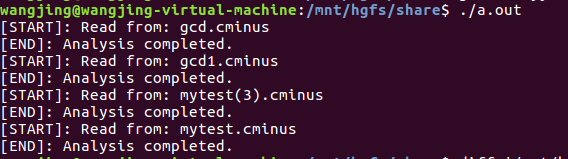

## 编译原理实验——lab1_lexical_analyzer

### PB17111651 王晶

#### 一、实验设计：

##### 1.  flex模式与动作

* lines、pos_start、pos_end的实现：

  定义一个全局变量count，通过count+=strlen(yytext)来计算每一行已扫描过的字符数，每遇到一个'\n',lines都加1，count更新为0。下面是pos_start和pos_end的计算方法：

  ```c
   pos_start=count+1;
      pos_end=pos_start+strlen(yytext);
      count+=strlen(yytext);
  ```

* \t、\r、空格等特殊字符的处理方法：无需计算pos_start和pos_end，只计算当前count的值。

  ```c
  [\t\r]+   {count+=strlen(yytext);}
  [ ]+ { count+=strlen(yytext);return BLANK;}
  ```

* \n的处理方法：出现了几个\n，lines就加几，同时count更新为0。

  ```c
  [\n]+      {lines+=strlen(yytext);count=0;}
  ```

* 注释的处理方法：

  ​        为了解决多行注释导致的行数难以计算与代码直接跟在注释后pos_start难以确定的情况，设置了布尔变量bool1，bool1的初始值设为1，当遇到“/*"时，bool1的值设为0。之后，当碰到\t、\r、空格等特殊字符时，动作仍旧与bool1的值为1时的情况相同。而碰到其它的字符与字符串时，不返回该字符，只更新pos_start，pos_end，count的值。

  ​        当碰到"*/"时，判断bool1是否为0，若为0，则将bool1的值设为1，并更新pos_start，pos_end，count的值，若为1则说明注释缺少"/\*"，返回ERROR。

  ​        当一个文档的字符都被读取结束时，再次判断bool1的值，若还为0，说明注释缺少"*/"，产生报错信息。

  ```c
  [/][*]      {pos_start=count+1;pos_end=pos_start+strlen(yytext);count+=strlen(yytext);bool1=0;return COMMENT;}
  [*][/]      {if(!bool1) {bool1=1;pos_start=count+1;pos_end=pos_start+strlen(yytext);count+=strlen(yytext);} else return ERROR;}
  
  ```

  ```c
  while(token = yylex()){
          switch(token){
              case ERROR:
                  fprintf(fp, "[ERR]: unable to analysize %s at %d line, from %d to %d\n", yytext, lines, pos_start, pos_end);
                  break;
              case COMMENT:
              case BLANK:
                  break;
              case EOL:
                  break;
              default :
                  fprintf(fp, "%s\t%d\t%d\t%d\t%d\n",yytext, token, lines, pos_start, pos_end);
          }
      }
  
      if(!bool1){//while循环结束后判断bool1是否为0，为0则报错。
          fprintf(fp, "[ERR]: unable to analysize %s at %d line, from %d to %d\n", yytext, lines, pos_start, pos_end);
          printf("[END]: Analysis completed.\n");
      }
      else
          printf("[END]: Analysis completed.\n");
      fclose(fp);
  ```

* [,]与[]的处理方法：由于flex遵循最大匹配的原则，故将它们分为三类:

  a. []

  b. [

  c. ]

  分别处理即可。只有当字符无法与"[]"匹配成功时，才会与"["匹配，并继续与"]"匹配。

  ```c
  [[][]]      {pos_start=count+1;pos_end=pos_start+strlen(yytext);count+=strlen(yytext);if(bool1) return ARRAY;}
  \[         {pos_start=count+1;pos_end=pos_start+strlen(yytext);count+=strlen(yytext); return LBRACKET;}
  []]         {pos_start=count+1;pos_end=pos_start+strlen(yytext);count+=strlen(yytext);if(bool1) return RBRACKET; }
  
  ```

* 关键字`else if int return void while`  的处理：

  ```c
  int         {pos_start=count+1;pos_end=pos_start+strlen(yytext);count+=strlen(yytext);if(bool1) return INT;}
  ```

  其余均与上述相同。

* 专用符号`+ - * / < <= > >= == != = ; , ( ) { }`的处理：

  ```c
  [=][=]      {pos_start=count+1;pos_end=pos_start+strlen(yytext);count+=strlen(yytext);if(bool1) return EQ;}
  ```

  其余均与上述相同。

* IDENTIFIE和NUMBER的实现：

  ```c
  [a-zA-Z]+        {pos_start=count+1;pos_end=pos_start+strlen(yytext);count+=strlen(yytext);if(bool1) return IDENTIFIER;}
  [0-9]+   {pos_start=count+1;pos_end=pos_start+strlen(yytext);count+=strlen(yytext);if(bool1) return NUMBER;}
  ```

* 返回ERROR：当所有字符可能出现的情况都枚举结束后，其余的情况都会返回ERROR，但为了正确指出错误发生的位置，仍需计算pos_start、pos_end、count的值。

  ```c
  .         { pos_start=count+1;pos_end=pos_start+strlen(yytext);count+=strlen(yytext); if(bool1) return ERROR;}
  ```

##### 2. 顺序读取文件夹中的文件并将结果写入到指定文件夹的文件中：

​     通过使用opendir和readdir函数可以打开一个指定文件夹并顺序读取其中的文件。同时要注意只能读取其中后缀为.cminus的文件，并将文件文件写入到./tokens文件夹下，文件名与输入文件名相同，后缀改为.tokens。

```c
void getAllTestcase(char filename[][256]){
    DIR *dp;
    struct dirent *dirp;
    int i,len,j,k;
    char dirname[]="./testcase";
    char s[10];
    char string[ ]="cminus";
    for(i=0;i<10;i++){
        strcpy(filename[i],"\0");
    }
    if((dp=opendir(dirname))==NULL){
        perror("opendir error");
        exit(1);
    }
    while((dirp=readdir(dp))!=NULL){
        if(strcmp(dirp->d_name,".")==0 || strcmp(dirp->d_name,"..")==0) continue;
        len=strlen(dirp->d_name);
        j=0;
        while(dirp->d_name[j]!='.')
            j++;
        j++;
        i=j;
        for(k=0;k<len-i;k++)
            s[k]=dirp->d_name[j++];
        s[k]='\0';
        if(strcmp(s,string)==0){
            strcpy(filename[files_count],dirp->d_name);
            files_count++;
        }
    }
}
```


#### 二、遇到的问题及解决方案：

* 直接通过忽略整行注释导致无法解决正确计算行号与代码直接跟在注释后pos_start难以确定的问题：

  **解决方案**：设置了布尔变量bool1，bool1的初始值设为1，当遇到“/*"时，bool1的值设为0。之后，当碰到\t、\r、空格等特殊字符时，动作仍旧与bool1的值为1时的情况相同。而碰到其它的字符与字符串时，不返回该字符，只更新pos_start，pos_end，count的值。

  ​        当碰到"*/"时，判断bool1是否为0，若为0，则将bool1的值设为1，并更新pos_start，pos_end，count的值，若为1则说明注释缺少"/\*"，返回ERROR。

  ​        当一个文档的字符都被读取结束时，再次判断bool1的值，若还为0，说明注释缺少"*/"，产生报错信息。

* [,]与[]不好区分：

  **解决方案**：由于flex遵循最大匹配的原则，故将它们分为三类:

  a. []

  b. [

  c. ]

  分别处理即可。

* 处理文件注释缺失"*/"的情况：

  **解决方案**：直接扫描至文件接收，判断bool1若为0，则打出ERROR信息报错。

* 读取多个文件的输入导致读取前一个文件后lines，pos_start，pos_end已具有初始值：

​       **解决方案**：每次读取一个文件后重置相应变量的值，具体代码见上文中analyzer函数。

* 产生ERROR信息时，报错信息产生位置错误：

​       **解决方案**：返回ERROR前也照例计算pos_start，pos_end，count的值。

#### 三、设计的测试样例及运行结果：

```c
int gcd (int u, int v) { /* calculate the gcd of u and v */
    if (v == 0) return u;
    else return gcd(v, u - u / v * v); /* v,u-u/v*v is equals to u mod v*/
}
int main() {
    &@ % /* ERROR */                        //该记号无法被识别
    int a , b, c;  /* INT & IDENTIFIER & COMMA & SEMICOLON */
    a = 2; /* ASSIN */
    b = 1;
    c = 0; /* NUMBER */
    c = a + b; /* ADD */
    c = a - b; /* SUB */
    c = a * b; /* MUL */
    c = a / b; /* DIV */
    c = (a < b); /* PARENTHESE & LT */
    c = (a <= b); /* LTE */
    c = (a > b); /* GT */
    c = (a >= b); /* GTE */
    c = (a == b); /* EQ */
    c = (a != b); /* NEQ */
    [ ] /* BRACKET */
    [,
    ,]
    [] /* ARRAY */
    {, /* BRACE */
    }
    if(a > b) a = a + 1; /* IF */
    else a = b + 1; /* ELSE */
    return 0; /* RETURN */
    void c; /* VOID */
    while (1) /* WHILE */
    comment1 /* jianf   
    aifj v */ comment                                //多行注释
    comment /* adbb */ term /* sabj */
	/* ajbkja
     *ajdf                                         //注释符"*/"缺失的情形
}

```

该样例已包含了所有可能出现的记号类型及产生报错的情况。**注**：用"//"指出的为额外添加的注释，为方便助教理解，不代表cminus有该用法。

**运行结果**：



#### 四、时间统计：

* 理解实验要求及flex用法：用时3小时
* 书写代码及调试：用时3小时
* 后期为应对特殊情况进行的修改：用时3小时
* 书写实验报告：用时2小时
* 总共用时：11小时


